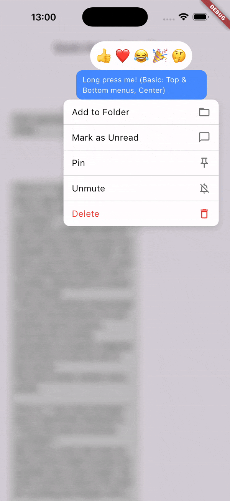
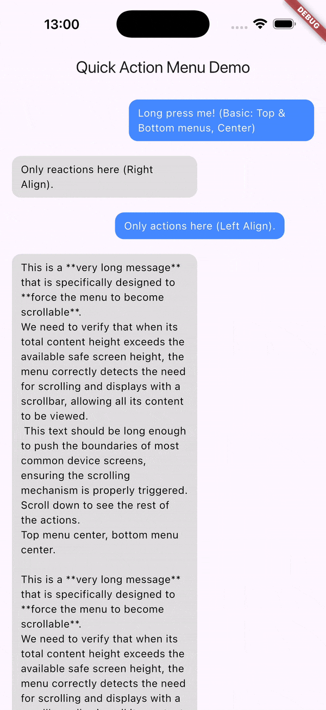

# Quick Action Menu

[](https://pub.dev/packages/quick_action_menu)
[](https://opensource.org/licenses/MIT)
[](https://flutter.dev)

A Flutter package for displaying highly customizable context menus inspired by Telegram and WeChat-style quick action menus. Perfect for chat applications, message bubbles, or any widget that needs contextual actions with smooth "flying" anchor animations and sticky menu behaviors.

Demo for basic and scrollable content usage:

|||
|:--:|:--:|

---

## Table of Contents

- [Features](#features)
- [Installation](#installation)
- [Quick Start](#quick-start)
- [API Reference](#api-reference)
  - [QuickActionMenu](#quickactionmenu)
  - [QuickActionAnchor](#quickactionanchor)
  - [QuickActionMenuState](#quickactionmenustate)
  - [Enums](#enums)
- [Advanced Usage](#advanced-usage)
  - [Custom Placeholders](#custom-placeholders)
  - [Dynamic Child Builder](#dynamic-child-builder)
  - [Programmatic Control](#programmatic-control)
- [Example](#example)
- [Contributing](#contributing)
- [License](#license)

---

## Features

| Feature | Description |
|---------|-------------|
| 🎯 **Contextual Menus** | Display customizable menus above and/or below any widget |
| ✨ **Anchor Animation** | Smooth "fly-in" and "fly-out" animations for the anchor widget |
| 📐 **Smart Positioning** | Automatically calculates optimal menu position based on screen boundaries |
| ↔️ **Horizontal Alignment** | Control menu alignment relative to the anchor (left, center, right) |
| 📌 **Sticky Behavior** | Menus can stick to viewport edges during scrolling |
| 🌫️ **Background Effects** | Customizable overlay with color tint and backdrop blur |
| 👆 **Easy Dismissal** | Tap outside or dismiss programmatically |
| ⚡ **Performance Optimized** | Efficient layout with `CustomMultiChildLayout` |
| 🔙 **Back Button Support** | Automatically handles Android back button to dismiss menu |

---

## Installation

### Manual Installation
Add `quick_action_menu` to your `pubspec.yaml`:

```yaml
dependencies:
  quick_action_menu: ^1.0.0
```

Then run:

```bash
flutter pub get
```

### CLI Installation

Alternatively, run the following command in your terminal:

```bash
flutter pub add quick_action_menu
```


---

## Quick Start

### 1. Wrap with QuickActionMenu

Wrap your widget tree with `QuickActionMenu` to enable the overlay system:

```dart
import 'package:flutter/material.dart';
import 'package:quick_action_menu/quick_action_menu.dart';

void main() => runApp(const MyApp());

class MyApp extends StatelessWidget {
  const MyApp({super.key});

  @override
  Widget build(BuildContext context) {
    return MaterialApp(
      home: QuickActionMenu(
        child: const MyHomePage(),
      ),
    );
  }
}
```

### 2. Define an Anchor

Wrap any widget with `QuickActionAnchor` and provide a unique `tag`:

```dart
QuickActionAnchor(
  tag: 'message_1',
  child: Container(
    padding: const EdgeInsets.all(16),
    decoration: BoxDecoration(
      color: Colors.blue,
      borderRadius: BorderRadius.circular(12),
    ),
    child: const Text(
      'Long press me!',
      style: TextStyle(color: Colors.white),
    ),
  ),
)
```

### 3. Show the Menu

Call `showMenu()` on the `QuickActionMenuState`:

```dart
GestureDetector(
  onLongPress: () {
    QuickActionMenu.of(context).showMenu(
      tag: 'message_1',
      topMenuWidget: _buildReactionMenu(),
      bottomMenuWidget: _buildActionBar(),
    );
  },
  child: QuickActionAnchor(
    tag: 'message_1',
    child: const MessageBubble(),
  ),
)
```

---

## API Reference

### QuickActionMenu

The root widget that manages the overlay system. Place this high in your widget tree.

```dart
const QuickActionMenu({
  required Widget child,
  Key? key,
})
```

| Property | Type | Description |
|----------|------|-------------|
| `child` | `Widget` | **Required.** The widget tree containing anchor widgets |

#### Static Methods

| Method | Returns | Description |
|--------|---------|-------------|
| `QuickActionMenu.of(context)` | `QuickActionMenuState` | Retrieves the nearest `QuickActionMenuState` from the widget tree |

---

### QuickActionAnchor

A widget that marks an anchor point for the quick action menu.

```dart
const QuickActionAnchor({
  required Object tag,
  Widget? child,
  QuickActionAnchorChildBuilder? childBuilder,
  QuickActionAnchorPlaceholderBuilder? placeholderBuilder,
  Key? key,
})
```

| Property | Type | Description |
|----------|------|-------------|
| `tag` | `Object` | **Required.** Unique identifier for this anchor |
| `child` | `Widget?` | The anchor widget (either `child` or `childBuilder` required) |
| `childBuilder` | `QuickActionAnchorChildBuilder?` | Builder for dynamic content based on extraction state |
| `placeholderBuilder` | `QuickActionAnchorPlaceholderBuilder?` | Builder for the placeholder shown when anchor is extracted |

#### Type Definitions

```dart
/// Builder for placeholder widget
typedef QuickActionAnchorPlaceholderBuilder = Widget Function(
  BuildContext context,
  Size heroSize,
);

/// Builder for dynamic child based on extraction state
typedef QuickActionAnchorChildBuilder = Widget Function(
  BuildContext context,
  bool isExtracted,
  Widget? child,
);
```

---

### QuickActionMenuState

The state object that controls menu display. Access via `QuickActionMenu.of(context)`.

#### Properties

| Property | Type | Description |
|----------|------|-------------|
| `isMenuDisplayed` | `bool` | Whether a menu is currently visible |

#### Methods

##### `showMenu()`

Displays the quick action menu for the specified anchor.

```dart
void showMenu({
  required Object tag,
  Widget? topMenuWidget,
  Widget? bottomMenuWidget,
  OverlayMenuHorizontalAlignment topMenuAlignment,
  OverlayMenuHorizontalAlignment bottomMenuAlignment,
  Duration duration,
  Duration? reverseDuration,
  Curve overlayAnimationCurve,
  Curve anchorFlyAnimationCurve,
  Curve topMenuScaleCurve,
  Curve bottomMenuScaleCurve,
  Color overlayBackgroundColor,
  double overlayBackgroundOpacity,
  double backdropBlurSigmaX,
  double backdropBlurSigmaY,
  bool reverseScroll,
  EdgeInsets padding,
  StickyMenuBehavior stickyMenuBehavior,
})
```

| Parameter | Type | Default | Description |
|-----------|------|---------|-------------|
| `tag` | `Object` | **Required** | The unique tag of the target `QuickActionAnchor` |
| `topMenuWidget` | `Widget?` | `null` | Widget displayed above the anchor |
| `bottomMenuWidget` | `Widget?` | `null` | Widget displayed below the anchor |
| `topMenuAlignment` | `OverlayMenuHorizontalAlignment` | `center` | Horizontal alignment of top menu |
| `bottomMenuAlignment` | `OverlayMenuHorizontalAlignment` | `center` | Horizontal alignment of bottom menu |
| `duration` | `Duration` | `Durations.short4` | Animation duration |
| `reverseDuration` | `Duration?` | `null` | Reverse animation duration (defaults to `duration`) |
| `overlayAnimationCurve` | `Curve` | `Curves.easeOutCubic` | Curve for overlay fade/blur animations |
| `anchorFlyAnimationCurve` | `Curve` | `Curves.easeOutSine` | Curve for anchor fly animation |
| `topMenuScaleCurve` | `Curve` | `Curves.easeOutCubic` | Curve for top menu scale animation |
| `bottomMenuScaleCurve` | `Curve` | `Curves.easeOutCubic` | Curve for bottom menu scale animation |
| `overlayBackgroundColor` | `Color` | `Colors.black` | Background color of the overlay |
| `overlayBackgroundOpacity` | `double` | `0.2` | Opacity of overlay background (0.0–1.0) |
| `backdropBlurSigmaX` | `double` | `10.0` | Horizontal blur sigma |
| `backdropBlurSigmaY` | `double` | `10.0` | Vertical blur sigma |
| `reverseScroll` | `bool` | `false` | Reverse scroll direction (useful for chat UIs) |
| `padding` | `EdgeInsets` | `EdgeInsets.zero` | Safe area padding for menu positioning |
| `stickyMenuBehavior` | `StickyMenuBehavior` | `none` | Sticky behavior during scrolling |

##### `hideMenu()`

Programmatically dismisses the currently displayed menu with animation.

```dart
Future<void> hideMenu()
```

---

### Enums

#### OverlayMenuHorizontalAlignment

Controls horizontal alignment of menu widgets relative to the anchor.

```dart
enum OverlayMenuHorizontalAlignment {
  left,    // Align menu to the left edge of anchor
  center,  // Center menu relative to anchor
  right,   // Align menu to the right edge of anchor
}
```

#### StickyMenuBehavior

Defines how menus behave when the overlay content scrolls.

```dart
enum StickyMenuBehavior {
  none,    // Neither menu sticks
  top,     // Top menu sticks to viewport top during scroll
  bottom,  // Bottom menu sticks to viewport bottom during scroll
  both,    // Both menus stick to their respective edges
}
```

---

## Advanced Usage

### Custom Placeholders

Define what appears in place of the anchor when it "flies" to the overlay:

```dart
QuickActionAnchor(
  tag: 'message_1',
  placeholderBuilder: (context, size) {
    return Container(
      width: size.width,
      height: size.height,
      decoration: BoxDecoration(
        color: Colors.grey.withOpacity(0.3),
        borderRadius: BorderRadius.circular(12),
      ),
    );
  },
  child: const MessageBubble(),
)
```

### Dynamic Child Builder

React to the extraction state with `childBuilder`:

```dart
QuickActionAnchor(
  tag: 'message_1',
  childBuilder: (context, isExtracted, child) {
    return AnimatedOpacity(
      opacity: isExtracted ? 0.5 : 1.0,
      duration: const Duration(milliseconds: 200),
      child: child,
    );
  },
  child: const MessageBubble(),
)
```

### Programmatic Control

Check menu state and dismiss programmatically:

```dart
final menuState = QuickActionMenu.of(context);

// Check if menu is displayed
if (menuState.isMenuDisplayed) {
  // Dismiss with animation
  await menuState.hideMenu();
}
```

---

## Example

A complete example is available in the [example](example/) directory.

```dart
import 'package:flutter/material.dart';
import 'package:quick_action_menu/quick_action_menu.dart';

class ChatScreen extends StatelessWidget {
  const ChatScreen({super.key});

  @override
  Widget build(BuildContext context) {
    return Scaffold(
      appBar: AppBar(title: const Text('Chat')),
      body: QuickActionMenu(
        child: ListView.builder(
          itemCount: 20,
          itemBuilder: (context, index) {
            final tag = 'message_$index';
            return GestureDetector(
              onLongPress: () => _showMenu(context, tag),
              child: QuickActionAnchor(
                tag: tag,
                child: MessageBubble(index: index),
              ),
            );
          },
        ),
      ),
    );
  }

  void _showMenu(BuildContext context, String tag) {
    QuickActionMenu.of(context).showMenu(
      tag: tag,
      topMenuWidget: const ReactionPicker(),
      bottomMenuWidget: const ActionBar(),
      padding: MediaQuery.of(context).padding,
      stickyMenuBehavior: StickyMenuBehavior.top,
    );
  }
}
```

---

## Contributing

Contributions are welcome! Please feel free to:

1. 🐛 Report bugs by [opening an issue](https://github.com/user/quick_action_menu/issues)
2. 💡 Suggest features or improvements
3. 🔧 Submit pull requests

---

## License

This project is licensed under the MIT License - see the [LICENSE](LICENSE) file for details.